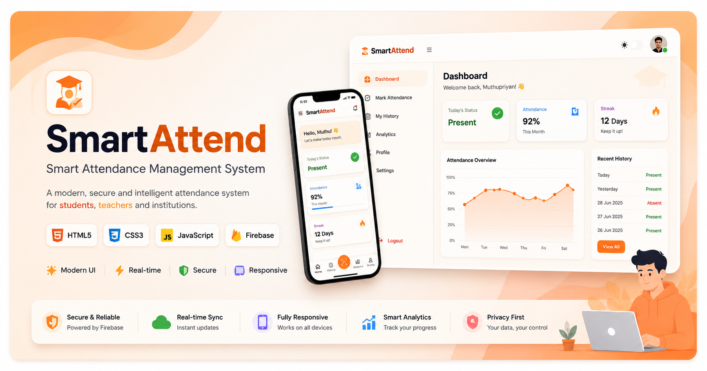

<p align="center">
  
</p>

<h1 align="center">🎓 SmartAttend</h1>

<p align="center">
A Modern Smart Attendance Management System built with HTML, CSS, JavaScript & Firebase.
</p>


---

## ✨ Features

- 👨‍🎓 Student Attendance Portal
- 👨‍🏫 Teacher Dashboard
- 🔒 Attendance Time Window Protection
- 📅 Real-time Date & Time
- 📜 Attendance History
- ☁️ Firebase Realtime Database
- 🔐 Firebase Authentication
- 📱 Fully Responsive Design
- 🌙 Dark Mode Support
- ⚡ Smooth Animations
- 🎨 Modern Glassmorphism UI
- 📊 Quick Statistics Dashboard
- 🔥 Attendance Streak
- 💯 Attendance Percentage Tracking

---

## 🛠️ Tech Stack

- HTML5
- CSS3
- JavaScript (ES6)
- Firebase Authentication
- Firebase Realtime Database
- Firebase Hosting
- GitHub Pages

---

## 📸 Screenshots

### Home


### History


### Teacher


---

## 🚀 Live Demo

👉 https://muthupriyan-dev.github.io/smart-attendance/attendance-system.html

---

## 📂 Project Structure

```
SmartAttend/
│
├── index.html
├── attendance-system.html
├── css/
├── js/
├── assets/
├── firebase/
└── README.md
```

---

## 🎯 Key Highlights

- Clean and Modern Dashboard
- Responsive on Mobile, Tablet & Desktop
- Secure Attendance Workflow
- Firebase Cloud Integration
- Optimized Performance
- User-friendly Interface
- Professional UI/UX

---

## 🔮 Future Improvements

- 📍 GPS Attendance
- 😀 Face Recognition
- 📷 QR Code Attendance
- 📄 PDF Report Export
- 📊 Advanced Analytics
- 🔔 Push Notifications
- 📅 Attendance Calendar
- 📈 Admin Dashboard

---

## 👨‍💻 Developed By

**Muthupriyan**

🌐 GitHub: https://github.com/muthupriyan-dev

💼 LinkedIn: *(https://www.linkedin.com/in/muthupriyan-s-b76698377?utm_source=share_via&utm_content=profile&utm_medium=member_android)*

📧 Email: *(smuthupriyan020108@gmail.com)*

---

## ⭐ Support

If you like this project, don't forget to ⭐ star the repository.

---


© 2026 Muthupriyan. All Rights Reserved.
